# Shannon SaaS Solution Architecture

**Version**: 1.1.0
**Date**: 2026-01-18
**Status**: Draft

## Executive Summary

Shannon SaaS is a multi-tenant, AI-powered penetration testing platform that transforms the existing Shannon CLI tool into a cloud-native service. The platform consists of two main packages in a monorepo structure:

- **Shannon**: The AI-powered penetration testing engine (Temporal workflows + Claude Agent SDK)
- **GhostShell**: The web application providing dashboard, reports, and management UI (Next.js + Prisma)

The architecture is designed around **7 constitutional principles** and comprises **8 functional epics**.

---

## System Context

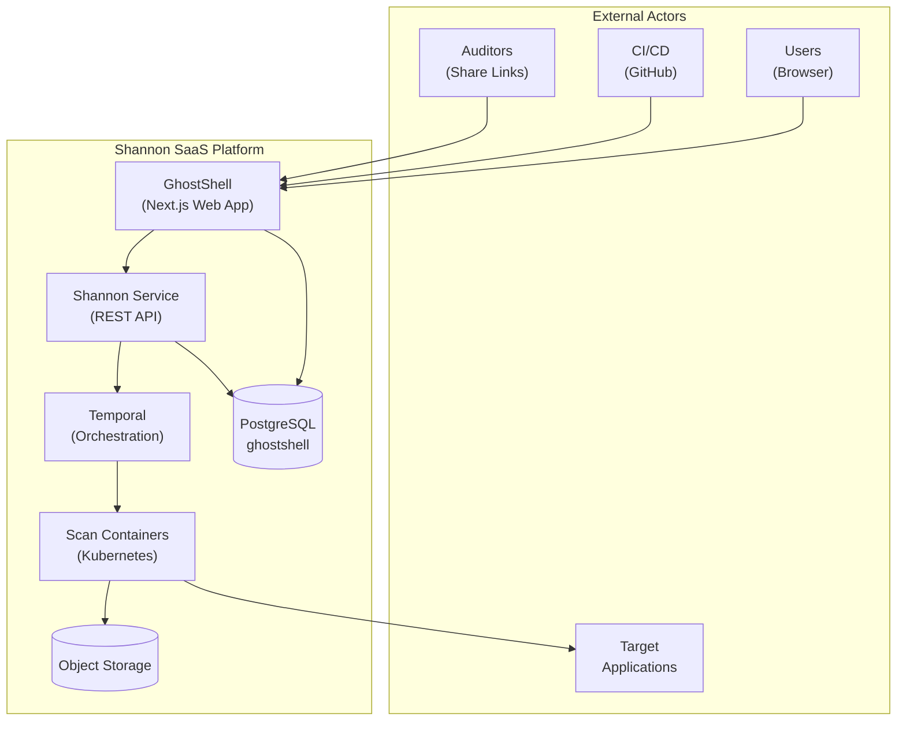

---

## High-Level Architecture

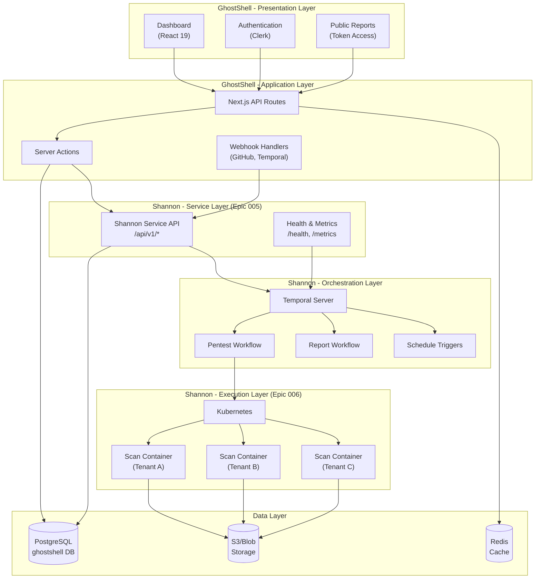

---

## Component Architecture

### GhostShell - Web Application Layer

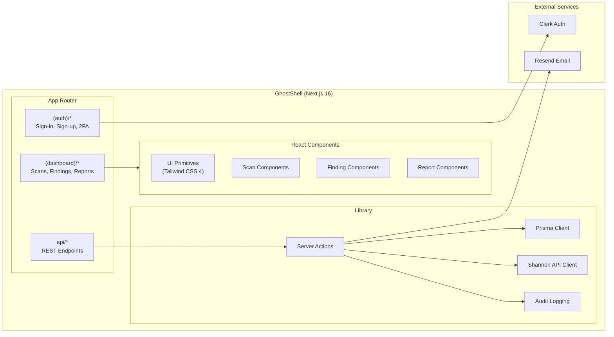

### Shannon Service Layer (Epic 005)

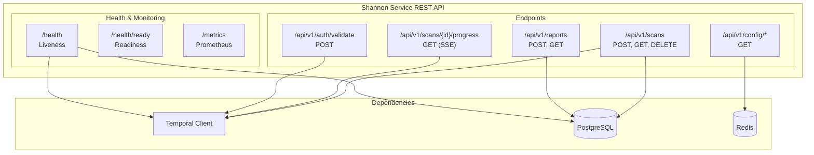

### Container Execution Layer (Epic 006)

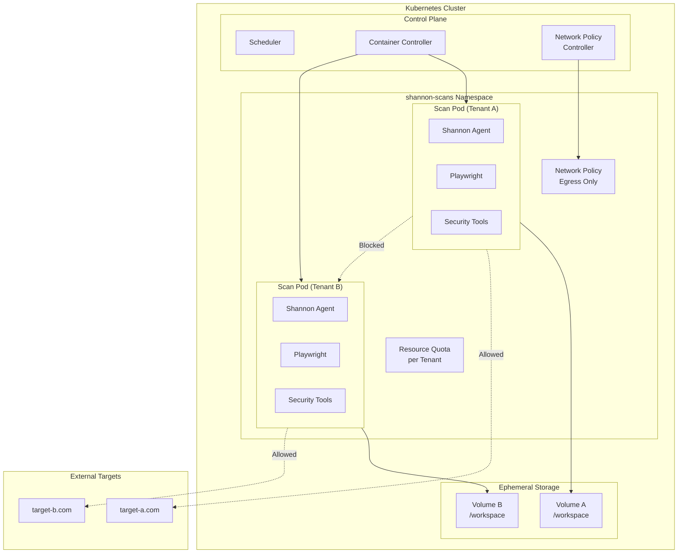

---

## Data Model

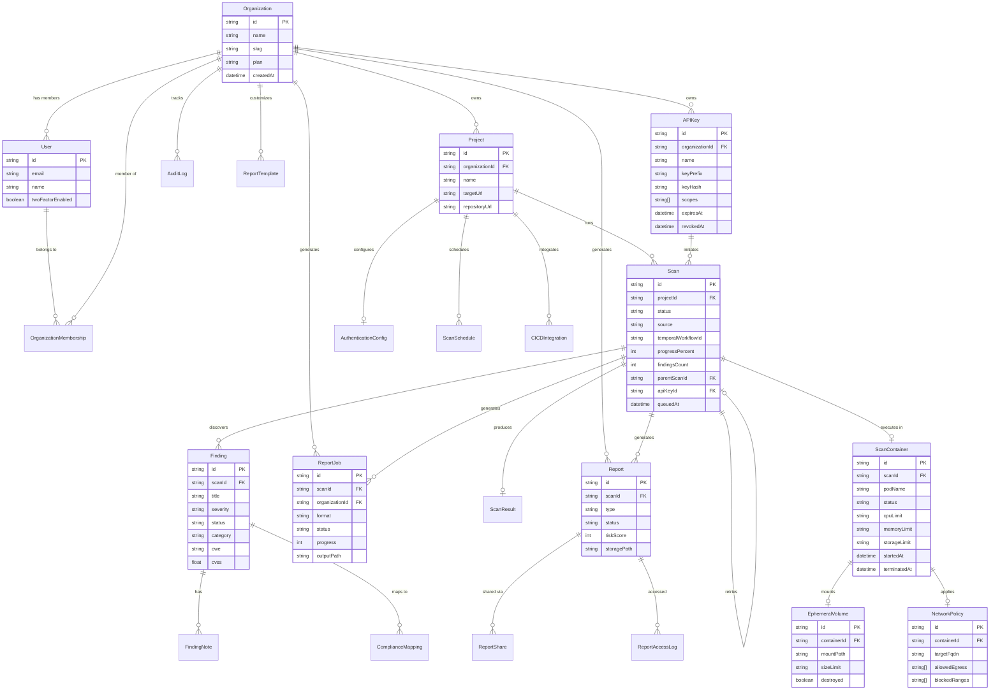

---

## Security Architecture

### Multi-Tenant Isolation

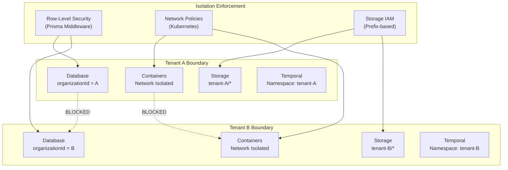

### Authentication Flow

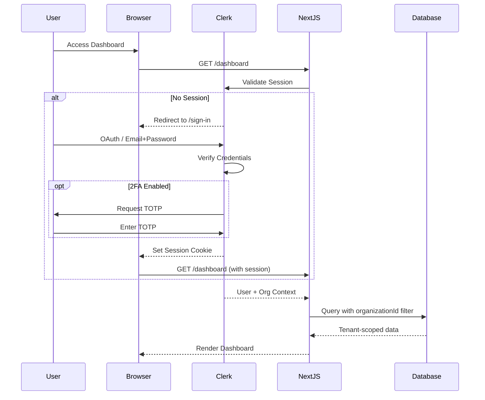

### Credential Encryption

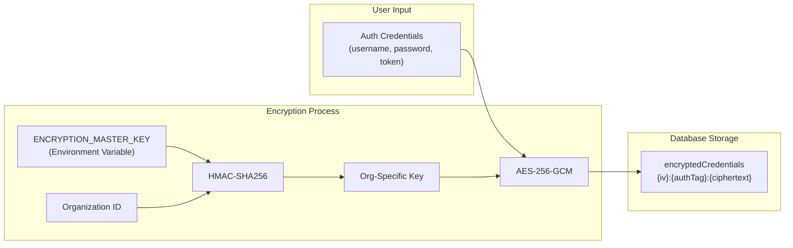

---

## Scan Execution Flow

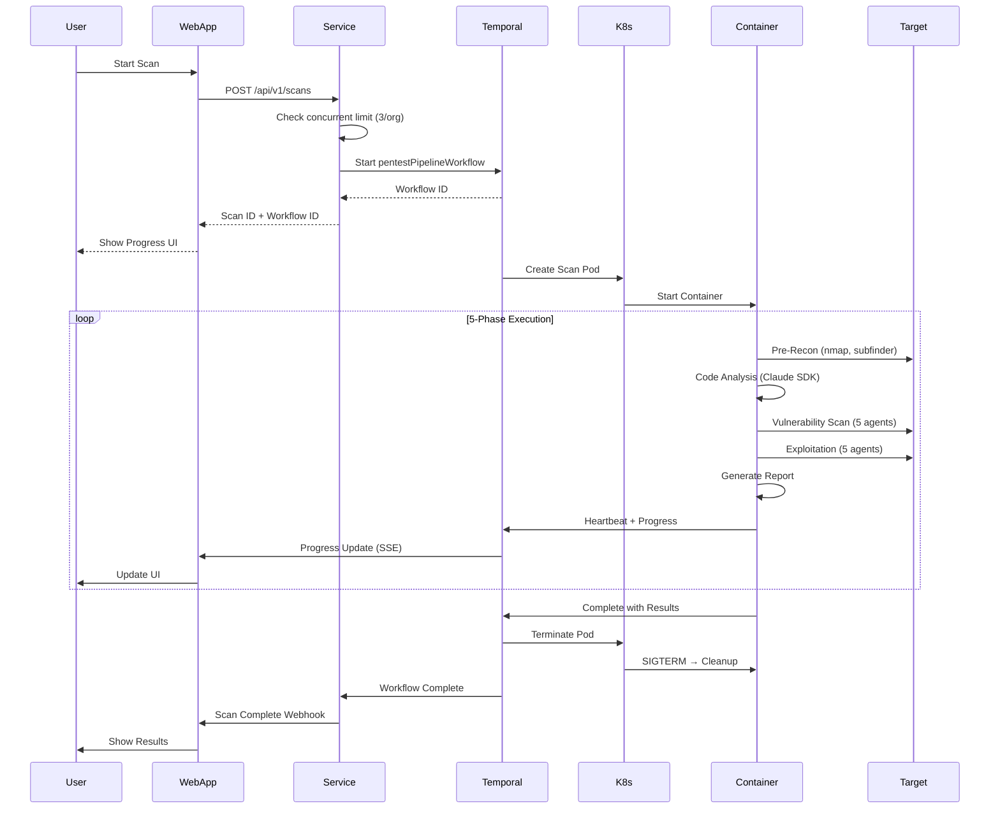

---

## Infrastructure Deployment

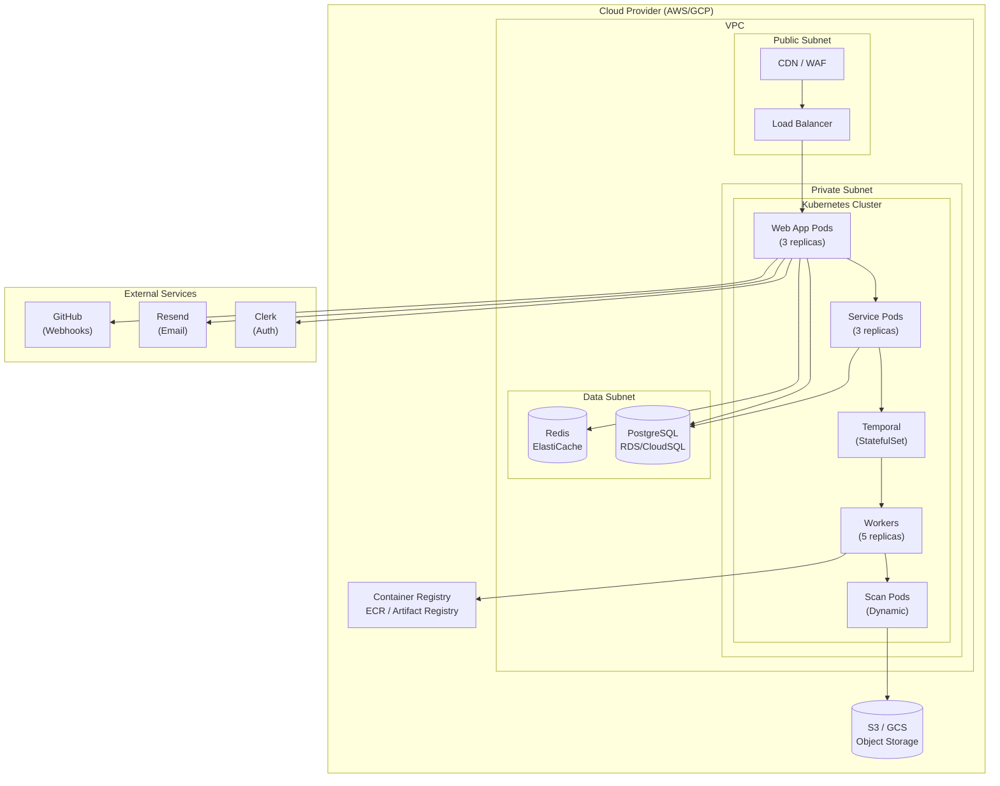

---

## Epic Dependencies

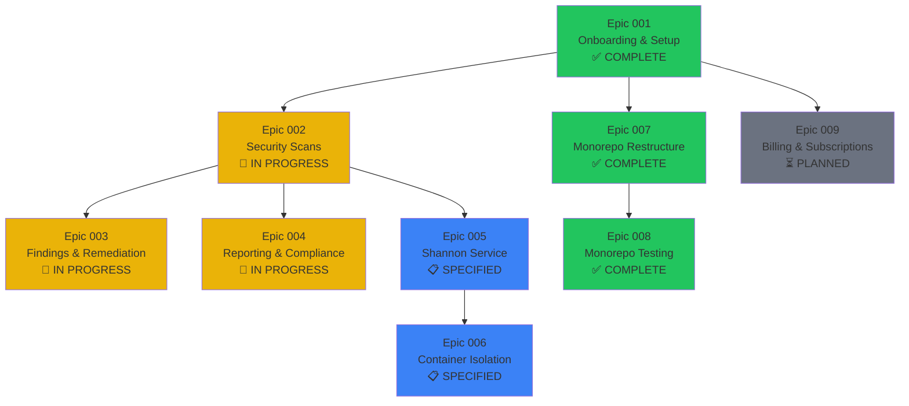

---

## Resource Limits by Plan

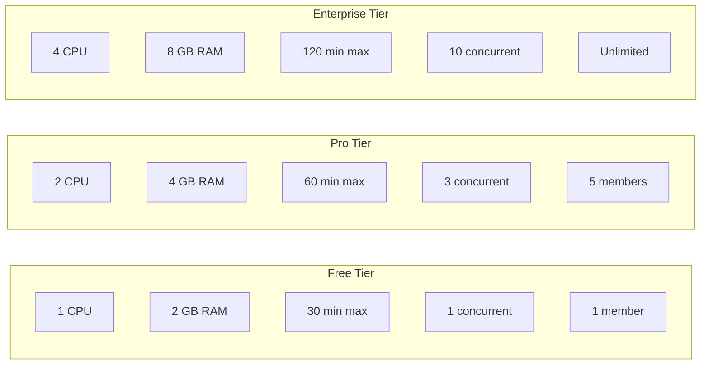

---

## Implementation Status

| Epic | Description | Status |
|------|-------------|--------|
| 001-onboarding-setup | Authentication, organization, team management | ✅ Complete |
| 002-security-scans | Quick scan, authenticated testing, scheduling, CI/CD | 🔄 In Progress |
| 003-findings-remediation | Finding detail, notes, filtering, bulk updates | 🔄 In Progress |
| 004-reporting-compliance | Reports, compliance mapping, sharing, scheduling | 🔄 In Progress |
| 005-shannon-service | Shannon REST API service layer | 📋 Specified |
| 006-container-isolation | Per-scan container sandboxing | 📋 Specified |
| 007-monorepo-restructure | Shannon/GhostShell separation, DB rename | ✅ Complete |
| 008-monorepo-testing | Vitest testing infrastructure | ✅ Complete |
| 009-billing | Stripe integration, subscriptions | ⏳ Planned |

**Legend:** ✅ Complete | 🔄 In Progress | 📋 Specified | ⏳ Planned

---

## Constitution Principles

| # | Principle | Key Requirements |
|---|-----------|------------------|
| I | Security-First | OWASP Top 10, encryption at rest, TLS 1.3, audit logging |
| II | AI-Native Architecture | Claude Agent SDK, max autonomy, cost tracking |
| III | Multi-Tenant Isolation | RLS, tenant namespaces, storage prefixes |
| IV | Temporal-First | All long-running ops as workflows, heartbeats, queryable |
| V | Progressive Delivery | Prioritized stories, independent testing, feature flags |
| VI | Observability-Driven | Structured logs, Prometheus metrics, OpenTelemetry |
| VII | Simplicity | YAGNI, managed services, minimal abstractions |

---

## Monorepo Structure

```
shannon/                  # Penetration testing engine (Temporal + Claude Agent SDK)
├── src/                  # Core application source
├── configs/              # YAML configuration files
├── prompts/              # AI prompt templates
├── docker/               # Docker-related files
├── mcp-server/           # MCP server implementation
├── __tests__/            # Shannon package tests
└── package.json          # Shannon package dependencies

ghostshell/               # Web application (Next.js + Prisma)
├── app/                  # Next.js app router
├── components/           # React components
├── lib/                  # Utilities and business logic
├── prisma/               # Database schema and migrations
├── __tests__/            # GhostShell package tests
└── package.json          # GhostShell package dependencies

specs/                    # Feature specifications
├── 001-onboarding-setup/
├── 002-security-scans/
├── 003-findings-remediation/
├── 004-reporting-compliance/
├── 005-shannon-service/
├── 006-container-isolation/
├── 007-monorepo-restructure/
└── 008-setup-monorepo-testing/

docker-compose.yml        # Orchestrates all services
package.json              # Workspace root configuration
vitest.workspace.ts       # Shared test configuration
```

---

## Next Steps

1. **Complete Epic 002** - Scheduled Scans (US4) and CI/CD Integration (US5)
2. **Complete Epic 003** - Final polish tasks
3. **Complete Epic 004** - Sharing, Scheduling, Dashboard, Templates
4. **Plan Epic 005** - Run `/speckit.plan specs/005-shannon-service`
5. **Plan Epic 006** - Run `/speckit.plan specs/006-container-isolation`
6. **Create Epic 009** - Billing & Subscription management
