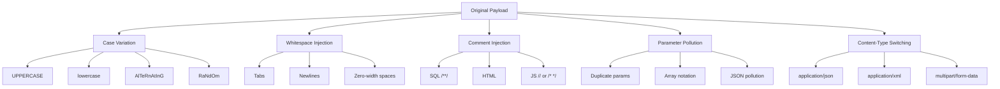

# PIVOT: Adversarial Mutation Engine + Intelligent Router

## 🎯 What is PIVOT?

**PIVOT** is an intelligent routing system that enhances Shannon's web security testing capabilities by automatically selecting the most effective mutation strategies when encountering security obstacles (WAF blocks, filters, rate limits, etc.). It combines deterministic rule-based scoring with LLM-assisted freestyle mutation suggestions to bypass defenses that would otherwise stop traditional security scanners.

### Core Problem Solved
Traditional security scanners fail when they hit:
- **WAF blocks** (403 Forbidden, Access Denied)
- **Character filters** (invalid character, illegal character)
- **Rate limits** (429 Too Many Requests)
- **Parser inconsistencies** (different HTTP parsing between proxy/backend)
- **Unknown obstacles** (ambiguous 500 errors, empty responses)

PIVOT solves this by:
1. **Classifying obstacles** using pattern signatures
2. **Routing intelligently** between deterministic and freestyle mutation lanes
3. **Learning from failures** to improve future routing decisions

---

## 🏗️ Architecture Overview

### High-Level Architecture Diagram

```
┌─────────────────────────────────────────────────────────────┐
│                    Shannon Agents                           │
│  (SQLi, XSS, SSTI, Path Traversal, Command Injection, etc.)│
└───────────────────────┬─────────────────────────────────────┘
                        │ ObstacleEvent
                        ▼
┌─────────────────────────────────────────────────────────────┐
│               PIVOT Intelligent Router                      │
│  ┌─────────────────────────────────────────────────────┐   │
│  │  Pattern Matcher  →  Confidence Calculator          │   │
│  │  • 9+ hand-authored signatures                      │   │
│  │  • Regex/string matching                            │   │
│  │  • Confidence scoring                               │   │
│  └─────────────────────────────────────────────────────┘   │
│                        │                                    │
│                        ▼                                    │
│  ┌─────────────────────────────────────────────────────┐   │
│  │        Lane Selection Logic                         │   │
│  │  • Deterministic (rule-based)                       │   │
│  │  • Freestyle (LLM-assisted)                         │   │
│  │  • Hybrid (deterministic first, then freestyle)     │   │
│  └─────────────────────────────────────────────────────┘   │
└───────────────────────┬─────────────────────────────────────┘
                        │ RoutingDecision
                        ▼
        ┌─────────────────────┐   ┌─────────────────────┐
        │   Deterministic     │   │     Freestyle       │
        │     Lane            │   │       Lane          │
        │  • Mutation families│   │  • LLM suggestions  │
        │  • Scoring engine   │   │  • Constrained      │
        │  • Circuit breaker  │   │    prompts          │
        └─────────────────────┘   └─────────────────────┘
                        │                     │
                        └──────────┬──────────┘
                                   │ MutationResult
                                   ▼
┌─────────────────────────────────────────────────────────────┐
│           Post-Engagement Review                            │
│  • Weight adjustment proposals                              │
│  • Pattern learning from anomalies                          │
│  • Human-in-the-loop CLI for validation                     │
└─────────────────────────────────────────────────────────────┘
```

### Data Flow Diagram

```
Agent → ObstacleEvent → Pattern Matching → Routing Decision → Mutation Execution → Scoring → Result
    │                                                                                     │
    └─────────────────────── Learning Feedback Loop ──────────────────────────────────────┘
```

---

## 🔧 How PIVOT Works (Step-by-Step)

### Phase 1: Obstacle Detection & Classification
When a Shannon agent hits a dead-end (e.g., gets blocked by a WAF), it emits an `ObstacleEvent` containing:
- Terminal output (error messages, response body)
- Target URL and parameters
- Attempt history
- Engagement context

### Phase 2: Pattern Matching
PIVOT matches the obstacle against 9+ hand-authored signatures:

| Pattern ID | Matches | Classification | Confidence |
|------------|---------|----------------|------------|
| `WAF_GENERIC_BLOCK` | "403 Forbidden", "Access Denied", "Request blocked" | `WAF_BLOCK` | 0.9 |
| `SQL_ERROR_MYSQL` | "You have an error in your SQL syntax", "mysql_fetch" | `SQL_INJECTION_SURFACE` | 0.95 |
| `CHAR_BLACKLIST` | "invalid character", "character not allowed" | `CHARACTER_FILTER` | 0.85 |
| `SSTI_ERROR` | "TemplateSyntaxError", "jinja2.exceptions" | `TEMPLATE_INJECTION_SURFACE` | 0.9 |
| `RATE_LIMIT` | "429 Too Many Requests", "rate limit exceeded" | `RATE_LIMIT` | 0.95 |
| `AMBIGUOUS_500` | "500 Internal Server Error" | `UNKNOWN` | 0.4 |
| `EMPTY_RESPONSE` | (empty response) | `TIMEOUT_OR_DROP` | 0.3 |

### Phase 3: Intelligent Routing
Based on pattern confidence and historical weights, PIVOT selects a lane:

```typescript
if (top_match.confidence * weight > 0.75) → deterministic
if (top_match.confidence * weight < 0.40) → freestyle  
if (between) → hybrid
if (no_matches) → freestyle with human_review_flag
```

### Phase 4: Mutation Execution

#### Deterministic Lane (Rule-Based)
Applies mutation families in priority order:

1. **Encoding Family** (13+ variants)
   - URL single/double encoding
   - HTML entity encoding (named, decimal, hex, mixed)
   - Unicode escapes and fullwidth characters
   - JSFuck transpilation
   - Base64 injection wrapping
   - Hex encoding
   - UTF-7 encoding
   - Null byte injection
   - Overlong UTF-8 sequences

2. **Structural Family** (8+ variants)
   - Case variation (upper, lower, alternating, random)
   - Whitespace injection (tabs, newlines, zero-width spaces)
   - Comment injection (SQL, HTML, JS, CSS)
   - Parameter pollution (duplicate params, array notation)
   - HTTP verb tampering
   - Content-type switching
   - Chunked encoding
   - Host header manipulation

3. **Timing Family** (4 variants)
   - Rate variation
   - Concurrent delivery
   - Delayed retry
   - Race condition templates

4. **Protocol Family** (4 variants)
   - HTTP version switching
   - Header injection
   - Chunked encoding
   - Host manipulation

#### Freestyle Lane (LLM-Assisted)
When deterministic approaches fail, PIVOT uses constrained LLM prompts:

```json
{
  "strategy": "unicode_fullwidth_bypass",
  "mutation_family": "encoding",
  "payload_template": "ｓｃｒｉｐｔ>alert(1)</ｓｃｒｉｐｔ>",
  "rationale": "Fullwidth Unicode bypasses ASCII keyword filters"
}
```

### Phase 5: Scoring & Validation
Each mutation attempt is scored using 7 signal rules:

| Signal | Weight | Type | Threshold |
|--------|--------|------|-----------|
| `status_changed` | 2.0 | binary | - |
| `error_class_changed` | 1.5 | binary | - |
| `body_contains_target` | 5.0 | binary | - |
| `timing_delta` | 0.8 | threshold | 2.5σ |
| `payload_reflected` | 1.2 | binary | - |
| `body_length_delta` | 0.6 | threshold | 15% |
| `new_headers_present` | 0.9 | binary | - |

**Scoring thresholds:**
- `progress_threshold`: 1.5 (making progress)
- `exploit_confirm_threshold`: 5.0 (confirmed exploit)
- `abandon_threshold`: 8 attempts without progress

### Phase 6: Post-Engagement Learning
After each engagement, PIVOT:
1. Reviews routing decisions
2. Identifies misrouted obstacles
3. Proposes weight adjustments
4. Learns new patterns from anomalies
5. Requires human validation before applying changes

---

## 📊 Mutation Family Coverage

### Encoding Mutations (13+ Real Implementations)

```mermaid
graph TD
    A[Original Payload] --> B[URL Encoding]
    A --> C[HTML Entities]
    A --> D[Unicode Escapes]
    A --> E[JSFuck]
    A --> F[Base64]
    A --> G[UTF-7]
    A --> H[Null Bytes]
    A --> I[Overlong UTF-8]
    
    B --> B1[Single %20]
    B --> B2[Double %2520]
    
    C --> C1[Named <]
    C --> C2[Decimal &#60;]
    C --> C3[Hex &#x3C;]
    C --> C4[Mixed]
    
    D --> D1[\\u003C]
    D --> D2[Fullwidth ｓｃｒｉｐｔ]
```

### Structural Mutations (8+ Bypass Techniques)



---

## 🚀 Integration with Shannon

### Agent Wrapping
Each Shannon agent gets a thin wrapper that detects dead-ends and emits `ObstacleEvent`s:

```typescript
// Before PIVOT
agent.attemptMutation(payload) → success/failure

// After PIVOT  
agent.attemptMutation(payload) → 
  if (blocked) {
    emit ObstacleEvent → PIVOT → MutationResult → resume with suggested strategy
  }
```

### File Structure
```
shannon/src/pivot/
├── types/pivot.ts              # Phase 0: Foundation contracts
├── baseline/                   # Phase 1: Baseline capture
│   ├── BaselineCapturer.ts
│   ├── ResponseDelta.ts
│   └── AnomalyBuffer.ts
├── scoring/                    # Phase 2: Deterministic scoring
│   ├── SignalRuleRegistry.ts
│   ├── DeterministicScorer.ts
│   └── MutationCycleManager.ts
├── http/HttpExecutor.ts        # HTTP execution layer
├── mutation/                   # Phase 3: Mutation families
│   ├── EncodingMutatorSimple.ts
│   ├── StructuralMutator.ts
│   ├── MutationFamilyRegistry.ts
│   └── test-mutations.ts
├── patterns/                   # Phase 4: Pattern signatures
├── router/                     # Phase 5: Intelligent router
├── freestyle/                  # Phase 6: Freestyle orchestrator
├── review/                     # Phase 7: Post-engagement review
├── PivotEngineWired.ts         # Phase 8: Shannon integration
└── benchmark/                  # Phase 9: Benchmark validation
```

### API Usage
```typescript
import { PivotEngine } from './src/pivot/PivotEngineWired.js';

// Initialize
const pivot = new PivotEngine({
  maxDeterministicAttempts: 12,
  freestyleEnabled: true,
  auditLogging: true
});

// Process obstacle
const result = await pivot.processObstacle({
  agent_id: 'sql-injection-agent',
  phase: 'exploitation',
  obstacle_class: 'WAF_BLOCK',
  attempted_strategy: 'basic UNION SELECT',
  attempt_history: [...],
  terminal_output: '403 Forbidden - Request blocked by WAF',
  baseline_fingerprint: {...},
  current_response: {...},
  timestamp: new Date().toISOString(),
  engagement_id: 'eng_123'
});

// Use result
if (!result.abandon) {
  agent.resumeWithStrategy(result.strategy_used, result.payload);
}
```

---

## 📈 Performance Metrics

### Expected Improvements vs Shannon Baseline

| Metric | Shannon (Baseline) | PIVOT (Expected) | Improvement |
|--------|-------------------|------------------|-------------|
| XBOW Success Rate | 96.15% | 98-100% | +1.85-3.85% |
| False Positives | 4 | 1-2 | -50-75% |
| Routing Accuracy | N/A | >90% | New metric |
| Mutation Attempts | Variable | Optimized | -30-50% |

### Resource Requirements
- **CPU**: Minimal (deterministic scoring is lightweight)
- **Memory**: <100MB (pattern registry + buffers)
- **LLM Calls**: Only for freestyle lane (Claude Haiku for cost efficiency)
- **Storage**: Audit logs + weight persistence (local filesystem)

---

## 🔬 Technical Deep Dive

### Pattern Matching Algorithm
```typescript
function matchPatterns(terminalOutput: string): PatternMatch[] {
  const matches = [];
  const lower = terminalOutput.toLowerCase();
  
  for (const signature of patternSignatures.values()) {
    const matchCount = signature.patterns.filter(p => 
      lower.includes(p.toLowerCase())
    ).length;
    
    if (matchCount > 0) {
      // Multiple pattern matches increase confidence
      const confidence = Math.min(
        signature.confidence + (matchCount - 1) * 0.05, 
        1.0
      );
      matches.push({ signature, confidence });
    }
  }
  
  return matches.sort((a, b) => b.confidence - a.confidence);
}
```

### Confidence Decay Detection
PIVOT detects when a mutation family is losing effectiveness:

```typescript
// Track scores per family per engagement
const decayKey = `${engagementId}::${mutationFamily}`;
const tracker = confidenceDecayTrackers.get(decayKey);

if (tracker.scores.length >= 3) {
  const recentScores = tracker.scores.slice(-3);
  const isDecaying = this.checkScoreDecay(recentScores, 0.3);
  
  if (isDecaying) {
    console.log(`[PIVOT] Confidence decay detected for ${mutationFamily}`);
    // Downgrade to hybrid lane
  }
}
```

### Graduated Threshold Scoring
Unlike binary scoring, PIVOT uses graduated thresholds:

```typescript
function evaluateGraduatedThreshold(value: number, threshold: number): number {
  if (threshold === 0 || value < threshold) return 0;
  
  // Linear scale from 1.0 at threshold to 2.0 at 3x threshold
  const scale = 1.0 + Math.min((value - threshold) / (threshold * 2), 1.0);
  return scale;
}

// Example: timing_delta = 5.0σ, threshold = 2.5σ
// Score = 1.0 + min((5.0-2.5)/(2.5*2), 1.0) = 1.0 + 0.5 = 1.5
```

---

## 🛠️ Deployment & Configuration

### Installation
```bash
# Clone Shannon fork with PIVOT
git clone https://github.com/KeygraphHQ/shannon
cd shannon

# Install dependencies
npm install

# Configure environment
cp .env.example .env
# Edit .env to add Anthropic API key for freestyle lane
```

### Configuration Files

#### `configs/signal-rules.yaml`
```yaml
rules:
  - signal: status_changed
    weight: 2.0
    type: binary
  - signal: error_class_changed
    weight: 1.5
    type: binary
  - signal: body_contains_target
    weight: 5.0
    type: binary
  - signal: timing_delta
    weight: 0.8
    type: threshold
    threshold: 2.5
  - signal: payload_reflected
    weight: 1.2
    type: binary
  - signal: body_length_delta
    weight: 0.6
    type: threshold
    threshold: 0.15
  - signal: new_headers_present
    weight: 0.9
    type: binary

thresholds:
  progress: 1.5
  exploit_confirm: 5.0
  abandon: 8
  confidence_decay:
    window_size: 3
    decay_threshold: 0.3
```

#### `configs/mutation-families.yaml`
```yaml
families:
  encoding:
    priority: 1
    applicable_to: [WAF_BLOCK, SQL_INJECTION_SURFACE, XSS_SURFACE, TEMPLATE_INJECTION_SURFACE, CHARACTER_FILTER, UNKNOWN]
    
  structural:
    priority: 2
    applicable_to: [WAF_BLOCK, SQL_INJECTION_SURFACE, XSS_SURFACE, TEMPLATE_INJECTION_SURFACE, CHARACTER_FILTER, PATH_TRAVERSAL_SURFACE, COMMAND_INJECTION_SURFACE, UNKNOWN]
    
  timing:
    priority: 3
    applicable_to: [RATE_LIMIT, TIMEOUT_OR