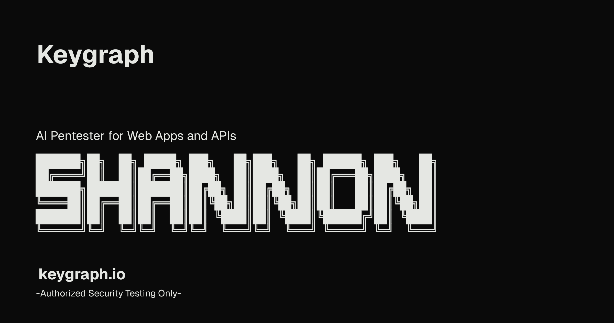

> [!NOTE]
> **📢 New:** Claude models on AWS Bedrock and Google Vertex AI are now supported.
> → https://github.com/KeygraphHQ/shannon/discussions/categories/announcements

<div align="center">



# Shannon — Autonomous AI Pentester

<a href="https://trendshift.io/repositories/15604" target="_blank">

</a>

**Shannon is an autonomous AI-powered penetration testing tool for web applications and APIs.**

It analyzes your application's source code, identifies attack vectors, and executes real exploits to validate vulnerabilities before they reach production.

---

🌐 Website: https://keygraph.io
📢 Announcements: https://github.com/KeygraphHQ/shannon/discussions/categories/announcements
💬 Community: https://discord.gg/KAqzSHHpRt

</div>

---

# 🎯 What is Shannon?

Shannon is an AI pentesting framework developed by **Keygraph** designed to perform **white-box security testing** on modern web applications.

Unlike traditional vulnerability scanners, Shannon combines:

* **Source code analysis**
* **Browser automation**
* **Command-line exploitation tools**
* **AI reasoning**

to automatically discover and validate vulnerabilities.

Only vulnerabilities that include a **working proof-of-concept exploit** are included in the final report.

---

# ⚡ Key Highlights

✔ Autonomous AI pentesting
✔ Proof-of-Concept exploit generation
✔ OWASP vulnerability coverage
✔ Source-code aware testing
✔ Parallel vulnerability analysis
✔ Automated reporting

---

# 🧠 Why Shannon Exists

Modern development teams ship code continuously.

But security testing often happens **once per year**, leaving a massive security gap.

Shannon solves this by enabling **on-demand penetration testing** that can run:

* before each release
* during CI/CD pipelines
* during internal security audits

This helps teams identify vulnerabilities **before attackers do**.

---

# 🏗 Architecture Overview

Shannon uses a **multi-agent AI architecture** consisting of four phases:

1️⃣ Reconnaissance
2️⃣ Vulnerability Analysis
3️⃣ Exploitation
4️⃣ Reporting

Each phase is executed by specialized AI agents that collaborate to discover and validate vulnerabilities.

---

# 🚀 Quick Start

```bash
git clone https://github.com/KeygraphHQ/shannon.git
cd shannon

export ANTHROPIC_API_KEY="your-api-key"

./shannon start URL=https://example.com REPO=repo-name
```

The system will automatically:

* build Docker containers
* start the pentesting workflow
* generate vulnerability reports
