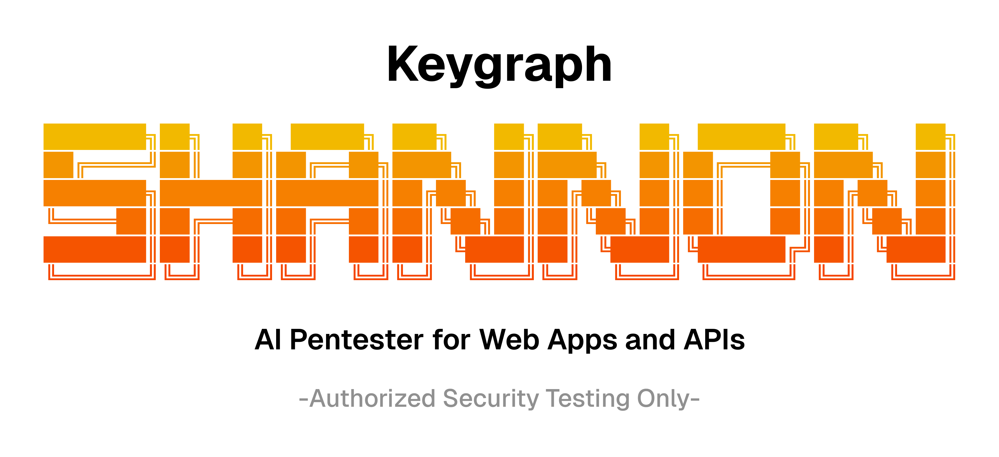
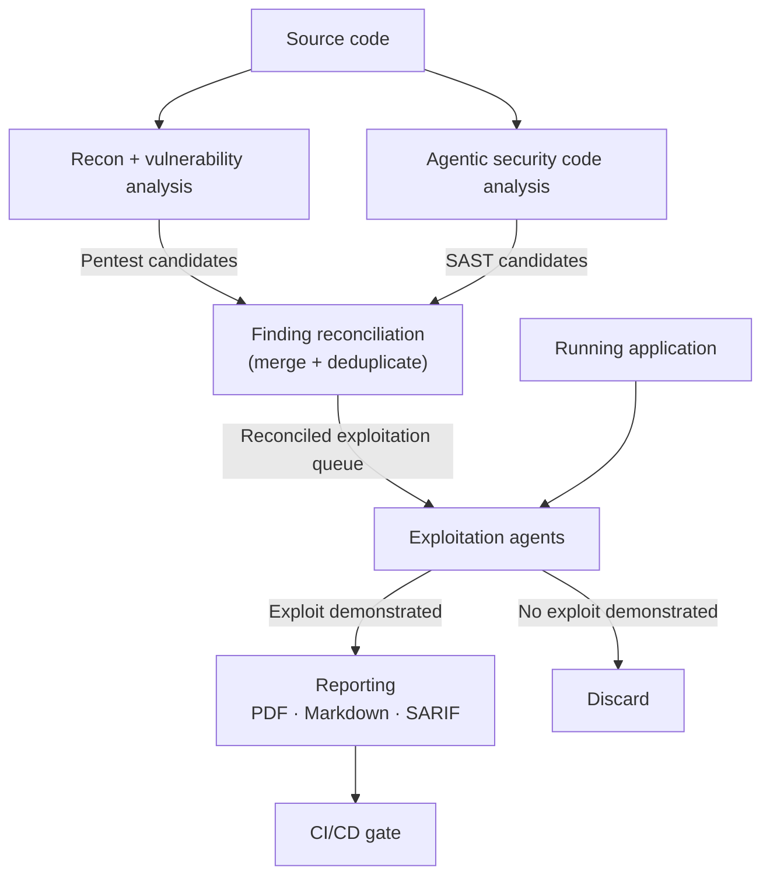

> [!NOTE]
> **Shannon 3.0 is live:** deeper security code analysis, a rebuilt terminal experience, native CI/CD workflows, professional PDF reports, and SARIF—still fully open source, self-hosted, and bring-your-own-model.





### Shannon is an autonomous, AI pentester for web applications and APIs.

It analyzes your source code, identifies attack paths, and executes real exploits to prove vulnerabilities before they reach production. **No exploit, no report.**

**This repository is Shannon Open Source: the full agent, run locally from your command line.**

---

      

---


> [!TIP]
> **AI agents and LLMs:** start with [llms.txt](llms.txt) for a concise map of this repository, or use [llms-full.txt](llms-full.txt) for the README and docs combined into one file.


## Table of Contents

- [Table of Contents](#table-of-contents)
- [What is Shannon?](#what-is-shannon)
  - [Why Shannon Exists](#why-shannon-exists)
  - [Why "Shannon"?](#why-shannon)
  - [Not a replacement for human pentesters](#not-a-replacement-for-human-pentesters)
- [Shannon in Action](#shannon-in-action)
- [Quick Start](#quick-start)
  - [Prerequisites](#prerequisites)
  - [Run Shannon](#run-shannon)
- [Key Capabilities](#key-capabilities)
- [CI/CD Integrations](#cicd-integrations)
  - [GitHub Actions](#github-actions)
- [Editions](#editions)
- [Architecture](#architecture)
- [Documentation](#documentation)
- [Safety, Scope, and Limitations](#safety-scope-and-limitations)
- [License](#license)
- [About Keygraph](#about-keygraph)
- [Community and Support](#community-and-support)
- [Common Questions](#common-questions)
  - [Can I self-host Shannon?](#can-i-self-host-shannon)
  - [Does Shannon support bring your own key (BYOK)?](#does-shannon-support-bring-your-own-key-byok)
  - [Does Shannon output SARIF?](#does-shannon-output-sarif)
  - [Which AI providers does Shannon support?](#which-ai-providers-does-shannon-support)
  - [Can I run Shannon on a local or self-hosted model?](#can-i-run-shannon-on-a-local-or-self-hosted-model)
  - [Does Shannon actually exploit vulnerabilities, or just scan?](#does-shannon-actually-exploit-vulnerabilities-or-just-scan)


## What is Shannon?

Shannon is an autonomous AI pentester developed by [Keygraph](https://keygraph.io). It performs security testing of web applications and their underlying APIs by combining source-code analysis with live exploitation.

Shannon analyzes your web application's source code to identify potential attack vectors, then uses browser automation and command-line tools to execute real exploits against the running application and its APIs. Only vulnerabilities with a working proof-of-concept are included in the final report.

Shannon is the agent. This repository is Shannon Open Source, the standalone pentester you run yourself. The same Shannon also powers the [Keygraph platform](https://keygraph.io), Keygraph's commercial pentesting product. See [Editions](#editions) for how the two compare.

### Why Shannon Exists

Thanks to tools like Claude Code and Cursor, your team ships code non-stop. But your penetration test? That happens once a year. This creates a massive security gap. For the other 364 days, you could be unknowingly shipping vulnerabilities to production.

Shannon closes that gap by providing on-demand, automated penetration testing that can run against every build or release.

### Why "Shannon"?

It's named after Claude Shannon, the father of information theory. At its core, pentesting is an information problem: every probe reduces uncertainty about a system's state. The best tools maximize the signal gained from every request, turning those bits of knowledge into an exploit path.

Also, we wanted you to be able to say, "Hey Claude, run Shannon" to find all the security flaws in your vibe-coded app.

### Not a replacement for human pentesters

Shannon is built to work alongside expert pentesters and red teamers, not replace them. Great pentesters understand the business, chain attacks in ways nobody anticipated, and bring years of judgment that current models can't match.

Shannon solves a different problem: there is far more software to test than security teams have time to cover. Critical systems get periodic expert assessments, while the long tail of internal apps, APIs, and fast-moving services rarely gets tested at all.

Shannon shifts pentesting left into the software development lifecycle (SDLC). Use it to run exploitation-backed tests against staging environments and releases at the cadence they actually ship, and save expert human time for the risks that need someone who knows the organization.

## Shannon in Action


Sample penetration test reports from intentionally vulnerable applications, produced by Shannon Open Source:


| Target           | Summary                                                                                                                  | Report                                                      |
| ---------------- | ------------------------------------------------------------------------------------------------------------------------ | ----------------------------------------------------------- |
| OWASP Juice Shop | 20+ vulnerabilities, including authentication bypass, SQL injection, IDOR, and SSRF.                                     | [View report](sample-reports/shannon-report-juice-shop.md)  |
| c{api}tal API    | Approximately 15 critical and high-severity API findings, including command injection, auth bypass, and mass assignment. | [View report](sample-reports/shannon-report-capital-api.md) |
| OWASP crAPI      | 15+ critical and high-severity findings across JWT, injection, SSRF, and API authorization paths.                        | [View report](sample-reports/shannon-report-crapi.md)       |


## Quick Start


### Prerequisites

- **Docker**: required for the worker container.
- **Node.js 18+**: required for the recommended `npx` workflow.
- **AI provider credentials**: Shannon runs on Anthropic, OpenAI, xAI, AWS Bedrock, [any other provider](docs/ai-providers.md#any-other-provider) in the harness catalogue, and any endpoint that speaks the Anthropic Messages API or the OpenAI Chat Completions or Responses API through a [custom base URL](docs/ai-providers.md#custom-base-url). You bring your own key, and Keygraph never proxies your model traffic. Shannon is provider-agnostic. See [AI providers](docs/ai-providers.md#suggested-models) for suggested model IDs.
- **Cyber safeguards cleared with your provider**: Anthropic and OpenAI apply real-time safeguards to cyber-security workloads, which can interrupt a scan mid-run. Complete their guidance for legitimate security testers before your first run - see [AI providers](docs/ai-providers.md#cyber-safeguards-do-this-before-your-first-scan).


### Run Shannon

> [!WARNING]
> Shannon actively executes exploits. Run it only against applications and environments you own or have explicit written authorization to test. Do not run Shannon against production systems.

```bash
# Configure credentials with the interactive wizard.
npx @keygraph/shannon@latest setup

# Run a pentest against a source-available target.
npx @keygraph/shannon@latest start \
  -u https://your-app.com \
  -r /path/to/your/repo
```

Shannon pulls the worker image from Docker Hub, starts the required local infrastructure, mounts the target repository read-only inside an ephemeral worker container, and writes results to a local workspace.

For source builds, authenticated scans, provider-specific setup, and platform notes, see [Documentation](#documentation).

> [!TIP]
> **Prefer to use a subscription instead of API credits?**
>
> - **OpenAI Codex:** The latest version of Shannon supports ChatGPT Plus and Pro subscriptions. Follow the [OpenAI Codex subscription setup guide](docs/ai-providers.md#openai-codex-chatgpt-pluspro-subscription) to get started.
> - **xAI (Grok):** The latest version of Shannon supports xAI subscriptions. Follow the [xAI subscription setup guide](docs/ai-providers.md#xai-grok-subscription) to get started.
> - **Claude Code:** The latest version of Shannon does not support Claude Code subscriptions. Follow the [Claude Code subscription setup guide](docs/ai-providers.md#claude-code-subscription) to use version `1.9.0`, which is the final release built on the Claude Agent SDK.


## Key Capabilities

- **No exploit, no report**: Shannon includes a vulnerability only after validating it with a working, reproducible proof of concept—eliminating the speculative warnings typical of scanners.
- **Advanced security code analysis**: Before it sends a single payload, Shannon reads the codebase and builds a picture of the application: architecture, trust boundaries, exposed interfaces, data flows, and the assets worth attacking. From there it opens targeted investigations and filters the candidates they turn up. What survives goes to the live pentesting agents.
- **Autonomous execution**: Shannon launches reconnaissance, vulnerability analysis, exploitation, and report generation from a single command.
- **Live terminal experience**: A rebuilt CLI makes scans easy to configure and shows agent progress and clean results without requiring operators to inspect the underlying orchestration logs.
- **Authenticated testing**: configuration files can describe login flows, test credentials, TOTP, email-based login flows, focus areas, and rules of engagement.
- **OWASP-focused coverage**: Shannon targets exploitable Injection, XSS, SSRF, Broken Authentication, and Broken Authorization issues.
- **Resumable workspaces**: Shannon can resume interrupted runs without re-running completed agents.
- **Native CI/CD integrations**: Run Shannon through the official GitHub Action or reusable GitLab CI/CD component. Preserve reports, SARIF, and logs as pipeline artifacts; publish findings into native security workflows; and gate releases only on vulnerabilities Shannon actually demonstrates.
- **Professional and machine-readable reports**: Shannon generates evidence-rich PDF and Markdown reports plus structured JSON and SARIF 2.1.0. SARIF is enabled by default on exploit-mode scans and can be disabled with `report.sarif: "false"`.
- **Bring your own key, provider-agnostic**: Shannon runs on Anthropic, OpenAI, xAI, AWS Bedrock, and any endpoint speaking the Anthropic Messages API or the OpenAI Chat Completions or Responses API, including self-hosted models served through Ollama, vLLM, or LM Studio and gateways such as OpenRouter and LiteLLM. You supply the credentials and choose exactly where model traffic goes. Local and self-hosted models are supported.
- **Private by design**: Shannon runs inside your infrastructure and writes results to a local workspace. Model requests go straight to the provider or endpoint you configure, and they carry source and application context with them, so choose that endpoint deliberately. Point Shannon at a local model endpoint and nothing leaves your environment.


## CI/CD Integrations

Shannon can run continuously against deployed staging and development environments through official integrations for [GitHub Actions](https://github.com/KeygraphHQ/shannon-action) and [GitLab CI/CD](https://gitlab.com/KeygraphHQ/shannon-ci).

Both integrations:

- analyze the checked-out source repository while attacking a running target;
- preserve PDF, Markdown, and SARIF reports as pipeline artifacts;
- preserve scan and agent logs for debugging, including incomplete runs;
- support pull-request, release, and scheduled pentests;
- distinguish an incomplete assessment from a completed scan with no findings; and
- optionally fail the pipeline when Shannon exploits a vulnerability at or above a configured severity threshold.

A code-analysis hypothesis does not fail the pipeline. Severity gates count only findings with `status: exploited`.

### GitHub Actions

```yaml
name: Shannon Pentest

on:
  workflow_dispatch:

permissions:
  security-events: write

jobs:
  pentest:
    runs-on: ubuntu-latest

    steps:
      - uses: actions/checkout@v4

      - name: Run Shannon
        uses: KeygraphHQ/shannon-action@v1
        with:
          url: https://staging.example.com
          api-key: ${{ secrets.SHANNON_AI_API_KEY }}
          fail-on-severity: high
          upload-sarif: true
```

The Action defaults `repo` to the checked-out GitHub workspace. It uploads one artifact containing the security assessment reports and SARIF, plus a separate run artifact containing scan and agent logs. Enabling `upload-sarif` publishes supported findings to GitHub code scanning.

Requirements:

- a private repository;
- a runner with Docker and Docker Compose v2;
- access to the running staging or development target; and
- a model-provider credential stored as a GitHub Actions secret.

See the [Shannon GitHub Action documentation](https://github.com/KeygraphHQ/shannon-action) and [GitHub Marketplace listing](https://github.com/marketplace/actions/shannon-ai-pentester).

## Editions

**Shannon Open Source** is the complete autonomous pentester for developers and security teams. It is optimized for fast local and CI/CD runs: understand the application, execute real attacks, and report only proven vulnerabilities.

**Keygraph Enterprise Platform** turns Shannon's proof engine into an organization-wide AppSec program, adding exhaustive analysis, centralized vulnerability management, automated remediation, enterprise governance, and continuous operation at scale.


|                     | Shannon Open Source                                                                                                                                                    | Keygraph Enterprise Platform                                                                                                                                                                              |
| ------------------- | ---------------------------------------------------------------------------------------------------------------------------------------------------------------------- | --------------------------------------------------------------------------------------------------------------------------------------------------------------------------------------------------------- |
| Best for            | Local and CI/CD pentesting                                                                                                                                             | Continuous AppSec across teams and repositories                                                                                                                                                           |
| Security analysis   | Multi-stage agentic review models architecture, trust boundaries, and data flows, filters candidate vulnerabilities, and hands the survivors to live pentesting agents | Exhaustive parsed-code agentic SAST: persistent Code Property Graphs, interprocedural source-to-sink and sanitizer modeling, cross-repository context, exploit-chain analysis, and business-logic testing |
| Additional coverage | Not included                                                                                                                                                           | SCA with reachability, secrets scanning, and business-logic testing                                                                                                                                       |
| AppSec operations   | N/A — standalone CLI                                                                                                                                                   | Canonical findings, deduplication, SLAs, analytics, automated remediation, and targeted verification                                                                                                      |
| Governance          | N/A — local, single-operator CLI                                                                                                                                       | SSO, SCIM, granular access control, APIs, and full audit logging                                                                                                                                          |
| Deployment          | Self-hosted, air-gapped, BYOM, AGPL-3.0                                                                                                                                | On-premises or air-gapped, granular model routing, commercial support                                                                                                                                     |


Shannon Open Source is not a trial edition. Choose Keygraph Enterprise when you need deeper analysis and a governed, closed-loop AppSec program.

[Explore the Keygraph Enterprise Platform →](docs/keygraph-platform.md)

## Architecture

Shannon combines multi-stage security code analysis with live reconnaissance and exploitation:


```mermaid
flowchart TD
    S["Source code"] --> EXISTING["Recon + vulnerability analysis"]
    S --> SAST["Agentic security code analysis"]

    EXISTING -- "Pentest candidates" --> REC["Finding reconciliation<br/>(merge + deduplicate)"]
    SAST -- "SAST candidates" --> REC

    REC -- "Reconciled exploitation queue" --> EXP["Exploitation agents"]
    APP["Running application"] --> EXP

    EXP -- "Exploit demonstrated" --> REPORT["Reporting<br/>PDF · Markdown · SARIF"]
    EXP -- "No exploit demonstrated" --> DROP["Discard"]

    REPORT --> CICD["CI/CD gate"]
```


Stage by stage:

1. **Recon and vulnerability analysis** explores the running application, ties runtime behavior back to the source, and runs specialized agents across Injection, XSS, SSRF, Authentication, and Authorization.
2. **Agentic security code analysis** maps the application's architecture, trust boundaries, exposed interfaces, dependencies, data flows, and high-risk assets, then opens targeted investigations against them.
3. **Finding reconciliation** merges both streams of candidates, deduplicates the overlap, and groups what remains into an exploitation queue.
4. **Exploitation agents** attempt real proof-of-concept attacks against the running application.
5. **Validation** throws out every candidate Shannon can't demonstrate.
6. **Reporting** produces PDF and Markdown reports with the evidence attached, plus structured JSON and SARIF for downstream systems.

Only live-validated vulnerabilities become Shannon pentest findings or count toward CI/CD severity gates.

Each scan runs in an ephemeral Docker container with an isolated workspace and per-invocation orchestration.

## Documentation

Use these guides for operational detail:


| Guide                                                     | Use it for                                                                                                                                                                |
| --------------------------------------------------------- | ------------------------------------------------------------------------------------------------------------------------------------------------------------------------- |
| [Source build and CLI commands](docs/development.md)      | Cloning, building, common commands, output paths, and local development.                                                                                                  |
| [Configuration](docs/configuration.md)                    | Authenticated testing, login flows, rules of engagement, and report filters.                                                                                              |
| [AI providers](docs/ai-providers.md)                      | Selecting the model, the supported providers (Anthropic, OpenAI, xAI, AWS Bedrock, and any other Pi-supported provider), and custom gateways.                             |
| [Platforms and networking](docs/platforms.md)             | Windows/WSL2, Linux, macOS, Docker networking, local apps, and custom hostnames.                                                                                          |
| [Workspaces and resuming](docs/workspaces.md)             | Naming workspaces, resuming interrupted scans, and workspace storage.                                                                                                     |
| [Safety and limitations](docs/safety.md)                  | Authorized-use requirements, non-production guidance, mutative effects, cost, and model caveats.                                                                          |
| [Coverage and roadmap](docs/coverage-roadmap.md)          | Current vulnerability coverage and planned work.                                                                                                                          |
| [Keygraph Enterprise Platform](docs/keygraph-platform.md) | Exhaustive agentic SAST, continuous pentesting, full-lifecycle finding management, remediation, targeted verification, enterprise governance, and on-premises deployment. |


## Safety, Scope, and Limitations

Shannon is not a passive scanner. Its exploitation agents can create users, submit forms, mutate application state, trigger outbound requests, and otherwise affect the target system. Use sandboxed, staging, or local development environments with disposable data.

You are responsible for using Shannon legally and ethically. Do not point Shannon at systems, repositories, or applications you do not own or do not have explicit authorization to test.

Important limitations:

- Shannon Open Source is tuned for fast, code-informed pentesting in everyday development and CI/CD. Exhaustive agentic SAST, broader scanner coverage, centralized governance, and full-lifecycle vulnerability management are delivered through the Keygraph Enterprise Platform.
- Findings still require human review. LLM-generated reports can contain weakly supported or incorrect details.
- Anthropic, OpenAI, xAI, and AWS Bedrock are built-in providers, and any Anthropic Messages API or OpenAI Chat Completions or Responses API endpoint works through a custom base URL. Model capability varies, and a model that does not follow Shannon's instructions or tool-use constraints reliably will produce weaker results.
- A full run can take roughly 1 to 1.5 hours and may incur LLM API costs depending on model pricing and application complexity.
- Do not scan untrusted or adversarial codebases. AI-powered tools that read source code can be exposed to prompt injection.

Read the full [Safety and limitations](docs/safety.md) guide before running Shannon in a new environment.

## License

Shannon Open Source is licensed under the [GNU Affero General Public License v3.0](LICENSE).

Commercial and enterprise licensing is available for organizations that need different license terms, commercial support, private redistribution, managed-service use, or broader deployment options, including the Keygraph platform.

For commercial licensing, contact [shannon@keygraph.io](mailto:shannon@keygraph.io).

## About Keygraph

**Keygraph** is the company behind Shannon. It also builds the **Keygraph platform**, the commercial agentic pentesting product that closes the full AppSec lifecycle and runs an enhanced build of Shannon as its pentesting engine.

## Community and Support

**Community office hours** are available for hands-on help with bugs, deployments, and configuration questions.

- US/EU: Thursday, 10:00 AM PT
- Asia: Thursday, 2:00 PM IST
- [Book a slot](https://cal.com/george-flores-keygraph/shannon-community-office-hours)

[Join Discord](https://discord.gg/cmctpMBXwE) to ask questions, share feedback, and connect with other Shannon users.

At this time, Keygraph is not accepting external code contributions. Issues are welcome for bug reports and feature requests:

- [Report bugs](https://github.com/KeygraphHQ/shannon/issues)
- [Suggest features](https://github.com/KeygraphHQ/shannon/discussions)

Stay connected:

- [Keygraph website](https://keygraph.io)
- [Twitter/X: @KeygraphHQ](https://twitter.com/KeygraphHQ)
- [LinkedIn: Keygraph](https://linkedin.com/company/keygraph)


## Common Questions


### Can I self-host Shannon?

Yes. Shannon Open Source runs inside your infrastructure in an ephemeral worker container. It mounts the repository read-only and writes results to a local workspace.

Keygraph never receives your source code and never proxies your model traffic. Your model requests go straight to the provider or endpoint you configure, and they carry source and application context with them. Point Shannon at a locally hosted endpoint and that traffic stays inside your environment too.

### Does Shannon support bring your own key (BYOK)?

Yes, always. You provide the LLM credentials Shannon uses to run a pentest, in every deployment, open source and commercial. Keygraph never proxies your model traffic.

### Does Shannon output SARIF?

Yes. Shannon emits SARIF 2.1.0, the OASIS standard format for static analysis results, alongside structured JSON. Any SARIF consumer reads it: code scanning services, vulnerability management platforms, security dashboards, and CI/CD pipelines. It is written by default on exploit-mode scans; set `report.sarif` to `"false"` in your configuration file to opt out.

### Which AI providers does Shannon support?

Anthropic, OpenAI, xAI, and AWS Bedrock are built in and configured directly by provider ID. Beyond those, Shannon runs on any endpoint that implements the Anthropic Messages API or the OpenAI Chat Completions or Responses API, reached through a custom base URL. The rule is the API format, not the vendor. Shannon uses a single unified model setting throughout a pentest.

### Can I run Shannon on a local or self-hosted model?

Shannon works with local models served through Ollama, vLLM, or LM Studio, which expose an OpenAI-compatible endpoint, as well as routers such as OpenRouter and gateways such as LiteLLM. Point Shannon at the endpoint with a custom base URL. Capability varies, and a model that does not follow Shannon's instructions or tool-use constraints reliably will produce weaker pentests than a frontier model, so take this path only if you know how your chosen model behaves. See [AI providers](docs/ai-providers.md#custom-base-url).

### Does Shannon actually exploit vulnerabilities, or just scan?

Shannon executes real exploits. It reports a finding only when it has produced a working proof-of-concept, and discards hypotheses it cannot prove. It is a pentester, not a passive scanner.

**Built by [Keygraph](https://keygraph.io)**