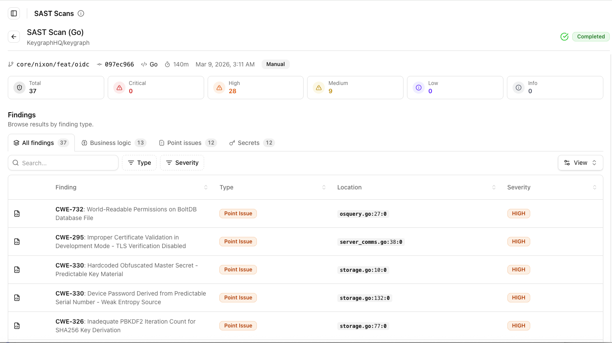
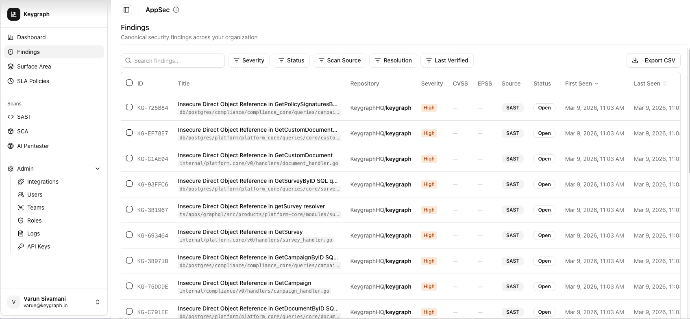
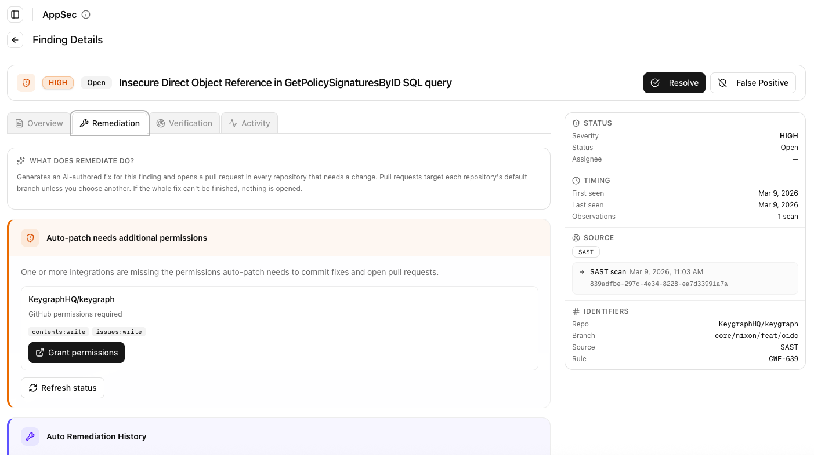
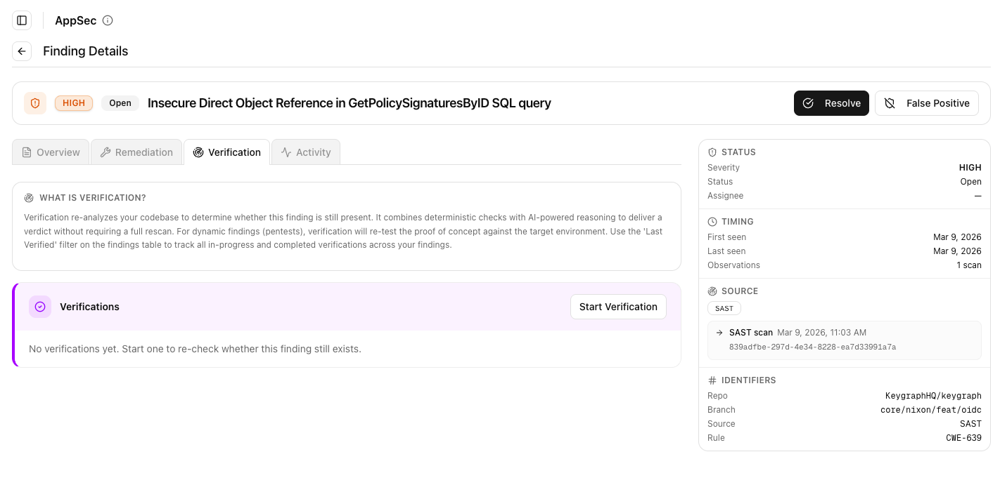
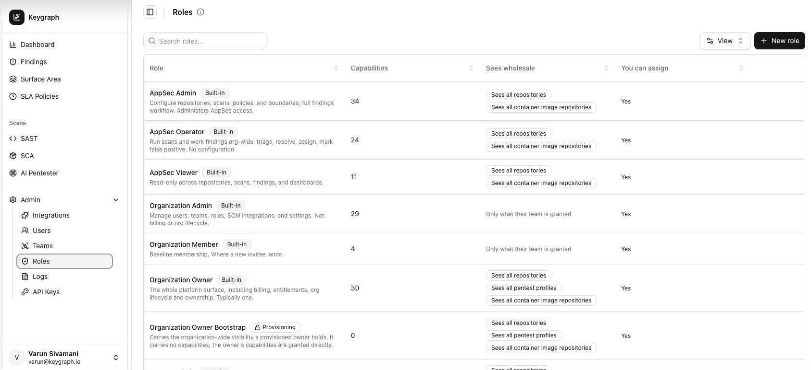

# Keygraph Enterprise Platform

Shannon 3.0 makes advanced, code-informed autonomous pentesting available to everyone. The open-source CLI maps routes and data flows, understands application architecture, executes real attacks, and produces PDF and SARIF results—locally, in CI/CD, or fully air-gapped with your own model.

The **Keygraph Enterprise Platform** is the commercial AppSec operating system for organizations that need to run that process continuously across many repositories, teams, and environments. It adds exhaustive agentic SAST, business-logic and source-to-sink analysis, broader scanner coverage, centralized vulnerability management, automated remediation and targeted verification, enterprise governance, and organization-wide reporting.

> Shannon Open Source is a complete autonomous pentester, not a trial edition. Keygraph Enterprise is for teams that need greater analysis depth, shared control, and a closed-loop vulnerability-management program.

## Who It Is For

Keygraph Enterprise is designed for organizations that need to:

- continuously test hundreds or thousands of repositories, services, applications, and APIs;
- combine agentic pentesting, SAST, SCA, secrets, and business-logic findings in one system;
- enforce security policy in GitHub Actions, GitLab CI, and enterprise delivery pipelines;
- give developers one canonical, actionable record for each vulnerability instead of duplicate scanner alerts;
- assign owners, apply SLAs, track status, and measure risk and remediation performance across the organization;
- generate fixes and verify them without rerunning an entire scan;
- enforce enterprise identity, authorization, audit, and API-access controls; and
- deploy fully on-premises or air-gapped with customer-controlled models, keys, and routing.

## Close the Entire AppSec Loop

The platform connects discovery, triage, remediation, and verification in one continuous workflow:

1. **Analyze** every repository with exhaustive agentic SAST and complementary scanners.
2. **Prove** exploitability with source-aware white-box, black-box, and grey-box pentesting.
3. **Normalize and deduplicate** results into a canonical finding per vulnerability and repository.
4. **Prioritize and assign** using severity, reachability, exploit evidence, ownership, policy, and business context.
5. **Remediate** with an AI-authored patch delivered as a reviewable pull request.
6. **Verify** the specific fix with deterministic checks and adversarial agent reasoning—without rerunning the full scan.
7. **Track and govern** status, exceptions, SLAs, audit history, trends, and compliance evidence until closure.

## Exhaustive Agentic SAST

Shannon 3.0's open-source code analysis is tuned for fast, everyday pentest runs. The Enterprise engine is designed for exhaustive audits. It parses the codebase and builds structural context before asking agents to reason about security:

- **Repository and architecture modeling** identifies services, frameworks, entry points, assets, trust boundaries, and cross-repository relationships.
- **Interprocedural call and data-flow analysis** traces values across functions, files, fields, containers, and framework-managed request lifecycles.
- **Source, sink, and sanitizer modeling** follows untrusted input to sensitive operations and records where validation, encoding, authorization, or other controls alter the path.
- **Threat-driven decomposition** breaks large applications into risk, taint-flow, framework, and specialist analysis tasks so deep scans remain systematic.
- **Adversarial verification** challenges each candidate as a potential false positive and weighs code evidence before it becomes a finding.
- **Semantic deduplication and exploit-chain analysis** consolidate variants of the same defect and identify combinations whose impact is greater than any isolated issue.
- **Business-logic invariant testing** derives rules the code is supposed to preserve—such as tenant isolation, workflow order, approval limits, balances, and state transitions—then agents fuzz those invariants for application-specific flaws.

The result is broad vulnerability hunting with precise paths back to the relevant code, not a flat list of pattern matches.

  

## Complete Application-Security Coverage

Agentic SAST and pentesting work alongside additional first-class scanners:

- **SCA with reachability** prioritizes vulnerable dependencies that application code can actually reach.
- **Full secrets scanning** detects credentials, tokens, and keys across source and repository history.
- **Agentic pentesting** correlates code intelligence with live application behavior and attempts real exploitation. The core rule remains: no exploit, no pentest finding.

## One System of Record for Every Finding

Keygraph ingests results from every analysis source, correlates them, and maintains one canonical finding per vulnerability per repository. Security and engineering teams work from the same record, with evidence, source location, severity, scan history, status, assignee, resolution, and last-verification state.

The vulnerability-management layer provides:

- deterministic and semantic deduplication across scans and scanners;
- ownership, assignment, triage, false-positive, risk-acceptance, and resolution workflows;
- SLA policies, escalation, aging, and last-verified tracking;
- bidirectional developer-workflow integrations and APIs;
- dashboards for risk, coverage, trends, new versus resolved findings, SLA compliance, and MTTR; and
- exportable evidence for customers, auditors, and compliance programs.

  

## Remediate, Then Verify the Fix

From an individual finding, a user can ask Keygraph to produce a focused patch. The remediation agent reasons from the root cause and evidence, changes only the required code, and opens a pull request into the existing review process. It does not silently apply fixes to a protected branch.

  

After a patch is available, targeted verification re-analyzes the affected code and, for dynamic pentest findings, re-tests the original proof of concept against the target. Deterministic checks and adversarial agent reasoning produce a clear verdict without the cost and delay of rerunning the entire scan.

  

## Enterprise Governance and Integrations

Keygraph is built for shared operation across security, platform, and engineering teams:

- SAML 2.0 or OIDC single sign-on and SCIM provisioning;
- organization, team, and user management;
- built-in and custom roles with granular relationship-, attribute-, and role-based authorization (ReBAC, ABAC, and RBAC);
- repository, pentest-profile, scanner, finding, and administration boundaries;
- full audit logging and scoped API keys;
- integrations with source control, CI/CD, ticketing, chat, and cloud environments; and
- commercial support and enterprise onboarding.

  

## On-Premises, Air-Gapped, and Customer-Controlled AI

Keygraph Enterprise can run entirely inside your AWS, GCP, Azure, or on-premises environment, including networks with no public internet access. Deployments can keep source code, scan artifacts, findings, prompts, completions, and model traffic inside your security perimeter.

AI access is bring-your-own-key and bring-your-own-model. Organizations can route workloads through approved commercial providers, private cloud endpoints, an internal LLM gateway, or local open-source models, with granular routing and policy controlled by the customer. There is no requirement for a Keygraph-operated control plane or model proxy.

Keygraph maintains a SOC 2 Type II audit and makes the current report available to customers under appropriate confidentiality terms.

## Shannon 3.0 vs. Keygraph Enterprise

| | Shannon Open Source | Keygraph Enterprise Platform |
| --- | --- | --- |
| Best for | Individual developers and teams running pentests locally or in CI/CD | Security organizations running a continuous AppSec program across many teams and repositories |
| Code analysis | Fast, attack-oriented analysis maps routes, data flows, architecture, and likely attack paths | Exhaustive agentic SAST traces interprocedural source-to-sink paths, models sanitizers, adversarially verifies candidates, deduplicates findings, and analyzes exploit chains |
| Pentesting | On-demand, source-aware white-box pentesting with proof by exploitation | Continuous white-box, black-box, and grey-box pentesting across applications and environments |
| Additional AppSec coverage | Not included | SCA with reachability, secrets scanning, and business-logic invariant testing |
| CI/CD and reporting | GitHub Actions and GitLab workflows, severity gating, PDF, Markdown, JSON, and SARIF | Central policies and gating, APIs and integrations, canonical findings, dashboards, analytics, SLA tracking, and compliance evidence |
| Automated remediation and verification | Not included | AI-authored pull requests with targeted code and exploit verification |
| Enterprise governance | N/A — local, single-operator CLI | SSO, SCIM, teams, ReBAC/ABAC/RBAC, audit logs, API keys, ownership, and SLA policies |
| Deployment and AI | Self-hosted, no telemetry, BYOM, and fully air-gapped with a local model | Fully on-premises or air-gapped, BYOK/BYOM, and granular routing through customer-controlled gateways |
| License and support | AGPL-3.0 and community support | Commercial license, enterprise support, and SOC 2 Type II controls |

## Talk to Keygraph

Visit [keygraph.io](https://keygraph.io), book a [Keygraph demo](https://cal.com/team/keygraph/shannon-pro), or contact [shannon@keygraph.io](mailto:shannon@keygraph.io).
