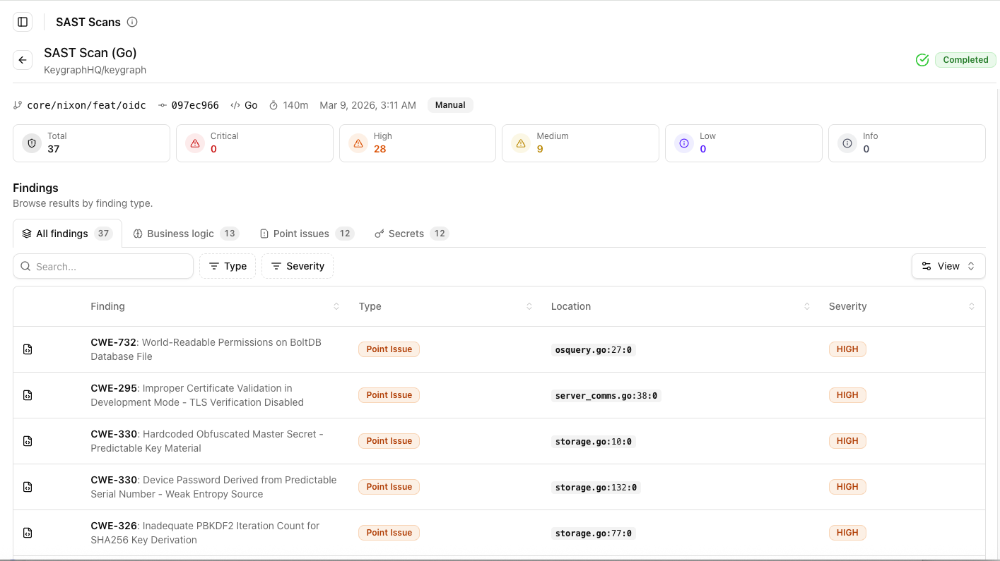
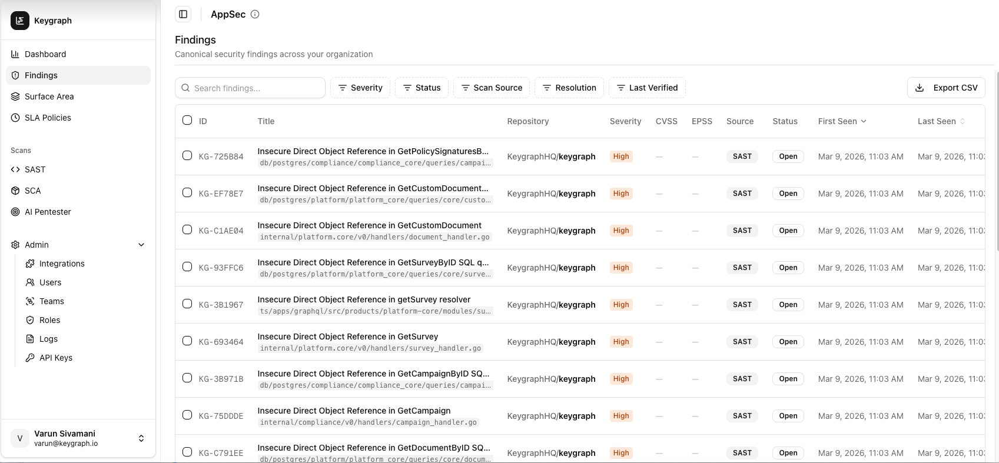
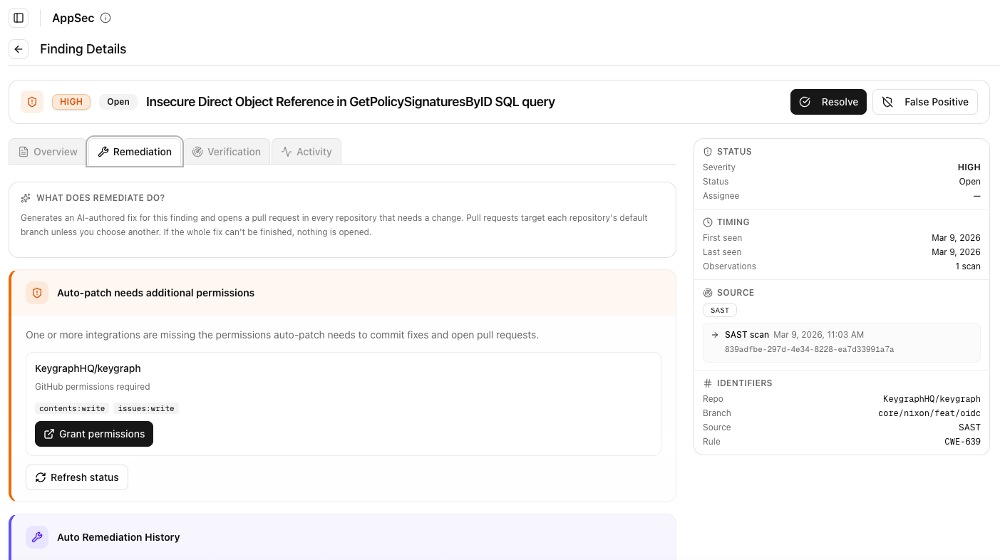
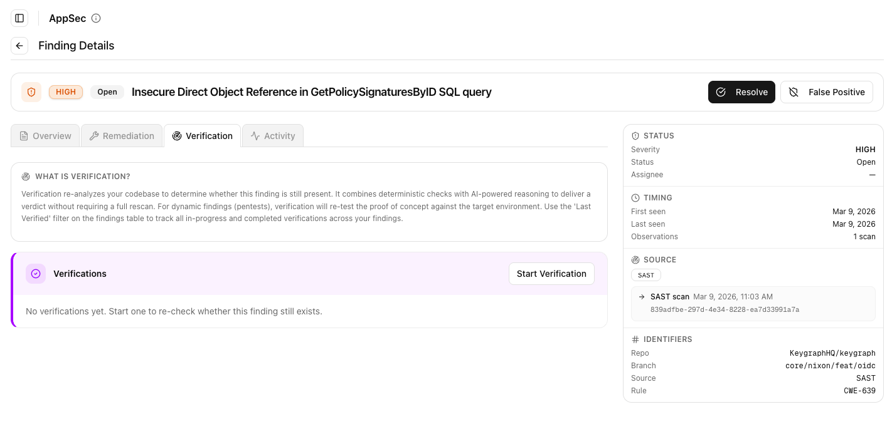
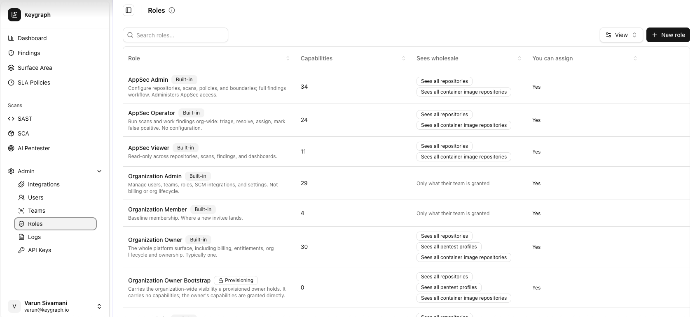

# Keygraph Pro and Enterprise

Shannon 3.0 is an open-source pentester. It reads your source, maps routes and data flows, runs real attacks against a live target, and writes PDF and SARIF reports. It runs locally, in CI, or air-gapped with your own model. Shannon is a complete pentester, not a trial edition.

Pro and Enterprise are Keygraph's commercial editions. They run an enterprise-hardened fork of Shannon continuously across hundreds of repositories and add what a security team needs around it: black-box pentesting that needs no source code, audit-depth static analysis on a parsed code graph, SCA and secrets scanning, one deduplicated record per vulnerability across scans and scanners, fix pull requests, fix verification, two-way Jira sync, and SSO, RBAC, and audit logs. They are for security teams that own vulnerability management across many engineering teams and need one place to triage, assign, fix, and verify.

The Community Program is Pro at no cost for organizations that qualify. Every module is included in Pro, Enterprise, and the Community Program. They differ in price, eligibility, hosting, and support. Current prices and the full feature table are at [keygraph.io/pricing](https://keygraph.io/pricing).

Every edition is BYOK: you bring your own model key and pay your provider directly. Shannon runs from your machine or CI runner, and Keygraph never receives your source or proxies your model traffic. The Community Program and Pro are cloud-hosted and managed by Keygraph. Enterprise deploys inside your cloud or data center, including fully air-gapped.

No source code? Use the [Blackbox Pentester](https://keygraph.io/agentic-blackbox-pentester).

## Compare editions

| | Shannon (open source) | Community Program | Pro | Enterprise |
| --- | --- | --- | --- | --- |
| Price | Open source under AGPL-3.0. You pay only your own model costs | $0 in cloud service fees while you qualify. You pay only your own AI provider usage | $50 per active developer per month, every module included, no add-ons | Custom |
| Best for | Developers and teams running repository-level pentests locally or in CI | U.S.-based 501(c)(3) nonprofits, and seed or pre-Series-A startups with 20 or fewer active developers | Teams that want every module, cloud-hosted and managed by Keygraph | Security organizations running continuous AppSec across many teams and repositories that need it inside their own environment |
| Code analysis | Agent pass over architecture, entry points, and data flows to seed the pentest, plus optional multi-stage security code analysis, sized to finish inside a CI run | Same as Pro | Persistent code property graph plus a long-running analysis harness with interprocedural taint, sanitizer modeling, cross-repo context, exploit chains, and multi-pass review | Same as Pro |
| White-box pentesting | On-demand, source-aware white-box pentesting with optional authenticated testing, focused on injection, XSS, SSRF, broken authentication, and broken authorization, with proof by exploitation | Same as Pro | Enterprise-hardened Shannon fork run continuously against white-box and grey-box targets, with proof by exploitation | Same as Pro |
| Black-box pentesting (no source code) | Not included. Shannon needs the target's source code | Same as Pro | Agents attack the running application from the outside with no source access, with up to 4 login credentials for multi-role testing. Findings are validated with working exploits | Same as Pro |
| SCA and secrets | Not included | Same as Pro | SCA with reachability and secrets scanning, including repository history | Same as Pro |
| Findings management | Per-run PDF, Markdown, JSON, and SARIF 2.1.0, with SARIF upload to GitHub code scanning | Same as Pro | One record per vulnerability per repository across scans and scanners, with status history, auto-reopen, ownership, SLAs, dashboards, and audit evidence | Same as Pro |
| Fix pull requests and retests | Fix manually from the report, then re-run the scan to verify | Same as Pro | Fix pull requests for a developer to review and apply, verified by re-analysis and exploit replay without a full rescan | Same as Pro |
| Ticketing | Not included | Same as Pro | Two-way Jira sync | Same as Pro |
| CI/CD and source control | GitHub Action and GitLab CI component for pull-request, release, and scheduled runs, with gates on `status: exploited` | Same as Pro | GitHub, GitLab, Azure DevOps, and Bitbucket with organization-wide policy and centrally managed integrations | Same as Pro |
| Deployment and models | Runs locally or on a CI runner with BYOK to any Anthropic- or OpenAI-compatible endpoint or local model | Same as Pro | Cloud-hosted and managed by Keygraph, in a US or EU region. BYOK: inference runs under your own model key and provider account | Deployed in your AWS, GCP, Azure, or on-prem environment, including fully air-gapped. Customer-hosted services and stored platform data remain inside your environment. Model requests go directly to the provider, private endpoint, gateway, or local model you configure. A local model supports fully disconnected deployments |
| Governance and compliance | Not included | Same as Pro | SSO via SAML 2.0 or OIDC with SCIM, RBAC, audit logs, SOC 2 Type II report under NDA, and a standard DPA | Same as Pro, plus a custom SLA and a security patch SLA |
| License and support | AGPL-3.0, community support on Discord | Community support on Discord, with no SLA or uptime commitment | Commercial license, with email and Slack support | Commercial license, with a support engineer, 24x7 Severity 1 support, quarterly business reviews, and white-glove onboarding |

### What Pro includes

Pro is cloud-hosted and managed by Keygraph, at $50 per active developer per month. Every module is included, with unlimited repositories and scans under BYOK. That covers white-box and black-box pentesting, agentic SAST, SCA, secrets scanning, findings management with status history, retests (fix verification by re-analysis and exploit replay), fix pull requests, two-way Jira sync, and SSO, RBAC, and audit logs.

None of these require Enterprise. Enterprise adds self-hosted or fully air-gapped deployment, a dedicated engineer and white-glove onboarding, and a custom SLA and security patch SLA.

The Community Program is Pro, with every module included, at $0 in cloud service fees for organizations that qualify. It is cloud-hosted only. See the [Community Program](https://keygraph.io/community-program) for eligibility and how to apply.

## How it fits your pipeline

1. Scans run on pull requests, releases, and a schedule against repositories in GitHub, GitLab, Azure DevOps, or Bitbucket.
2. Pipelines gate on exploited severity. A code-analysis hypothesis never fails a build.
3. Findings from every scanner and every run land as one record per vulnerability per repository, with an owner and an SLA. The same finding across ten runs is one record, not ten alerts.
4. From a finding, Keygraph opens a fix PR into your normal review flow, for a developer to review and apply.
5. Verification confirms the fix against the changed code and the original exploit. No full rescan is required.

## What is different technically

### Static analysis on a code property graph

Shannon's code analysis is sized to finish inside a CI run: agents read the repository, map the attack surface, and hand candidates to the pentester. Pro and Enterprise are built for depth instead. They first parse each repository into a persistent code property graph, then run an analysis harness derived from one built for long-running vulnerability audits, heavily adapted to query the graph rather than read files. The harness decomposes the application into risk, taint-flow, framework, and specialist tasks and supports longer-running audit workflows beyond typical CI job windows.

On the graph, they perform:

- Interprocedural taint tracking across functions, files, fields, containers, and framework request lifecycles.
- Source, sink, and sanitizer modeling that records where validation, encoding, or authorization changes a path.
- Cross-repository modeling of services, entry points, and trust boundaries.
- Semantic deduplication of variants of the same defect, and exploit-chain analysis for combinations with higher impact than any single issue.
- Multiple review passes per candidate, checking the agent's claim against the graph and available deployment and configuration context. Candidates that cannot be substantiated are not reported.

### Business-logic invariants

Shannon focuses on injection, XSS, SSRF, and broken authentication and authorization. Pro and Enterprise add testing for the bugs that do not fit a vulnerability class: they derive invariants the application is supposed to hold (tenant isolation, workflow ordering, approval limits, balance conservation, state transitions) and test them against the running application. This is where application-specific vulnerabilities live and where pattern-based SAST often provides little or no signal.

### Proof by exploitation

The pentesting engine is a hardened fork of Shannon with the same rule: a pentest finding requires a working exploit. No exploit, no finding. Pro and Enterprise store the exploit and replay it later to verify the fix.

The Blackbox Pentester applies the same rule without source access. It attacks the running application from the outside with a real browser and terminal, and it can take up to 4 login credentials (Google OAuth, GitHub, or custom auth) to test privilege escalation and IDOR across roles.

SCA prioritizes vulnerable dependencies that application code actually reaches. Secrets scanning covers current source and repository history.

  

## Findings

Shannon hands you a report per scan. Pro and Enterprise dedupe across runs and across scanners, deterministically and semantically, into one record per vulnerability per repository. Each record carries evidence, source location, severity, scan history, status, owner, resolution, and last-verified state. This is included in the Community Program, Pro, and Enterprise.

Workflows cover assignment, triage, false-positive and risk-acceptance decisions, and SLA policies with escalation and aging. A resolved finding that reappears in a later scan reopens automatically. Dashboards report open risk, coverage, new versus resolved, SLA compliance, and MTTR, exportable as evidence for customers and auditors. Findings sync both ways with Jira.

Findings still require human review. The extra review passes in Pro and Enterprise reduce weakly supported findings, but they do not eliminate them.

  

### Fix and verify

From a finding, Keygraph generates a patch scoped to that finding and opens a pull request for a developer to review and apply. It never commits to a protected branch.

  

Verification re-analyzes the changed code and, for pentest findings, replays the original exploit against the patched target. The verdict comes from deterministic checks plus a review pass, without rerunning the full scan.

  

## Deployment and access control

The Community Program and Pro are cloud-hosted and managed by Keygraph on AWS, with regional isolation in a US or EU region. Scans run in isolated, single-use containers that clone your repository and are destroyed when the scan ends. The full source tree is never persisted. Only the code fragments needed to render findings, deduplicate results, and propose fixes are kept, and all code-derived data is encrypted at rest. See [Code security posture](https://keygraph.io/code-security-posture) for the full controls.

Enterprise deploys entirely inside your AWS, GCP, Azure, or on-prem environment, including networks with no internet egress. There is no Keygraph-operated control plane. Customer-hosted services and stored platform data remain inside your environment for the life of the deployment.

Model access is BYOK and BYOM in every edition. Route workloads to Anthropic, OpenAI, xAI, or Bedrock, a private cloud endpoint, your own gateway such as LiteLLM with your routing and policy applied, or local models on vLLM or Ollama. In Enterprise deployments, model requests leave your environment only to reach the endpoint you configure, and a local model supports a fully disconnected deployment.

Access control, in the Community Program, Pro, and Enterprise: SAML/OIDC SSO, SCIM, roles with repository-scoped visibility (RBAC, plus attribute and relationship rules where needed), full audit log, scoped API keys.

  

Keygraph maintains a SOC 2 Type II audit. The report is available to customers under NDA.

## Talk to Keygraph

Visit [keygraph.io](https://keygraph.io), see [pricing](https://keygraph.io/pricing), apply to the [Community Program](https://keygraph.io/community-program), book a [demo](https://cal.com/team/keygraph/keygraph-technical-demo), or email [shannon@keygraph.io](mailto:shannon@keygraph.io).
